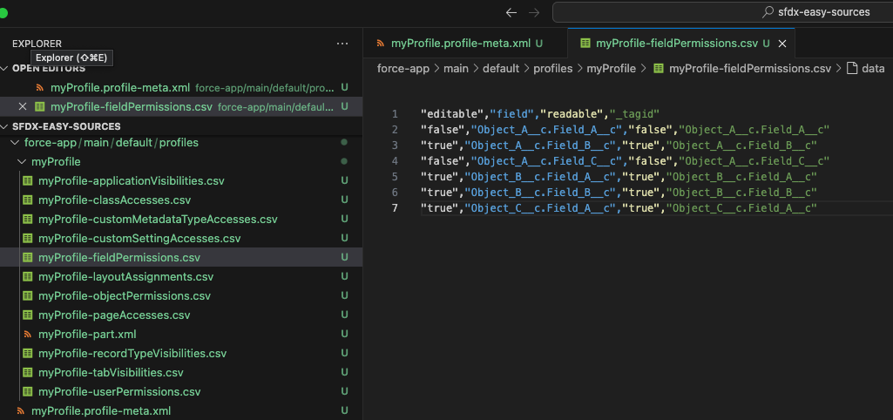
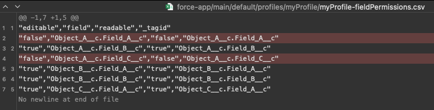

sfdx-easy-sources
=================
SFDX plugin to simplify the management of Salesforce sources, splitting some long xml files into smaller csv ones.

# [BETA]


[](https://npmjs.org/package/sfdx-easy-sources)
[](https://snyk.io/test/github/raffo93p/sfdx-easy-sources)
[](https://npmjs.org/package/sfdx-easy-sources)
[](https://github.com/raffo93p/sfdx-easy-sources/blob/master/package.json)

# What is sfdx-easy-sources?
This plugin helps salesforce developers, architects and release managers with the management of some Salesforce xml sources, expecially those which become easily very long and difficult to be handled with git version history.

With this plugin you can:
- Split those long xml files into some smaller csv
- Have a better look and comprehension of what is written in those files, thanks to all the VSCode extensions that can be used to manage csv
- Upsert the csv files after retrieving a package with some resources that are built based on what you put inside the package
- Merge the csv files into the original xml ones
- Delete some reference or permission from all the csv of a given metadata type
- Minify the csv by removing all the rows that don't increase the value of the file
- Clean the csv references to some resources that doesn't exist in the target org
- Setup a custom git merger to automatically resolve the csv conflicts while cherry picking or merging in git

## Supported metadata types

| Metadata Label| Metadata api | Available commands    |
| :---:    | :---:  | :---: | 
| All Meta | allmeta   | split, upsert, merge, minify, retrieve   |
| Profiles | profiles | split, upsert, merge, minify, updatekey, delete, clean |
| Record Types | recordtypes | split, upsert, merge, updatekey, delete, clean |
| Labels | labels | split, upsert, merge, updatekey |
| Global Value Sets | globalvaluesets | split, upsert, merge, updatekey |
| Global Value Set Translations | globalvaluesettranslations | split, upsert, merge, updatekey |
| Applications | applications | split, upsert, merge, updatekey |
| Object Translations | objecttranslations | split, upsert, merge, updatekey |
| Translations | translations | split, upsert, merge, updatekey |


```sh-session
$ npm install -g sfdx-easy-sources
or
$ sfdx plugin:install sfdx-easy-sources

GENERAL USAGE
  $ sfdx easysources:<metadataapi>:<command> [...parameters]
  $ sfdx easysources:<metadataapi>:<command> --help    // to get help, the list of parameters and some examples
Examples
  $ sfdx easysources:profiles:split
  $ sfdx easysources:labels:upsert
...
```


Based on the source type, this plugin provides the following commands:
- Split: Splits the resources into various csv files, and eventually an xml containing all the tags that weren't split
- Merge: Merges back all the resources previously split
- Upsert: It's like the split, but goes on upsert.
- Updatekey: Maybe sometimes a developer changes something on the csv file, this command simply updates the key for that record
- Delete: Bulk deletes a single permission from all the resources of the same type (only applies to Profiles, PermissionSets and Record Types)
- Minify: Bulk deletes each entry that doesn't add value to the file (example: a permission in a profile xml which has all permissions set to false)
- Clean: Bulk deletes all the references that are not present in the target org or in the repository

# Disclaimer
- Please experiment at first inside a dummy project!
- The command allmeta:retrieve --clean performs a delete of all the sources before retrieving them from the org. If something goes wrong while retrieving, you could have lost all the sources if you are not in a git environment. Please be careful!
- This software is given as-is, without warranty that it is free of bugs. So test the process before implement it in production.


# Let's start!
## Prerequisites
### Prerequisite 1 - Initialize the settings
This should be done once you have your sfdx project (for example after "Creating a new project with manifest").
To better instruct the plugin with the directories of the project, you can run the command
```sh-session
$ sfdx easysources:settings:init
```
and a file _easysources-settings.json_ will appear.
This file contains the directory of:
- the Salesforce sources (by default ./force-app/main/default)
- the csv files (by default the same of the salesforce sources)
- the log files.

Since I prefer to have the csv files near the xml ones, I left the default directories in my project. Consider that, in this case, you should need to:
- have a .forceignore file to ignore .csv and .part-xml files when running sfdx commands
- have a .pipelineignore file to ignore .csv and .part-xml files when running other plugins, for example when using sfdx-git-delta.

Simply put these lines inside those files
```sh-session
# easysources
*-part.xml
*.csv
```

### Prerequisite 2 - Retrieve all metadata
To deal with Salesforce files all the source code from the org must be downloaded in the repository.
One can perform this task in various ways, but this plugin also offers a simply way to download everything from the org.

```sh-session
$ sfdx easysources:allmeta:retrieve --orgname="orgname"
```


Some useful parameters are:
- --clean: if set to true, automatically deletes al the source folder before performing the retrieve
- --split-merge: if set to true, automatically performes a split and then a merge of all the sources, after they are retrieved

This command actually splits all the resources into various packages, trying to count the resources in every package to not exceed the "resnumb" number. It also creates some little packages, because profiles, permissionsets, translations and other particular metadata types should be retrieved building the package in a given way.
Suppose the profile packages are more then one, the algorithm should automatically perform a split after retrieving the first profile package, then it should perform an upsert after every other profile package retrieved, and at the end it should perform a merge and delete the created csv. Unfortunately, at this moment I didn't test this scenario!

### Prerequisite 3 - Create the csv files for the first time
Once all the metadata have been downloaded, before to start dealing with the csv files, you should create them the first time.
To do this run these commands (but first, please, understand the meaning of each command reading this guide)

```sh-session
$ sfdx easysources:allmeta:split
$ sfdx easysources:allmeta:minify
$ sfdx easysources:allmeta:merge
```

## Description of each command


### Split
The split command creates a folder at the same level of the file that it is splitting, containing various csv files and a part.xml file.
Inside the csv files you can find all the rows of a given type: each tag attribute becomes a column; the tags that are not mapped are copied in the part.xml file.

This is an example of an xml profile splitted in csv.
Once we run the command

```sh-session
  $ sfdx easysources:profiles:split
```
the plugin generates a folder with all the csv files.


### Upsert
Suppose the developer cretes a new object, he creates some fields, he assigns the fields, the layouts and the object permissions to the various profiles.
To update the profiles on the repository, he can:
1. Make the changes on Salesforce org
2. Create a package xml with the object, layout, fields and all profiles
3. Retrieve the package. All profiles will now contain only the tags related to the new object, layout and fields
4. *Execute the upsert command for profiles. The upsert command will insert the new tags into the csv*
5. Then he can merge back to have the profiles to be deployed elsewhere


**NOTE: the upsert doesn't delete any unused reference. If the user deletes a field, he should run the delete command**


### UpdateKey

Suppose the developer makes some modification directly on the csv. With the updatekey command, he can update the tagid column if needed.


### Merge

When the user needs to deploy the code, he first needs to merge back the csv files to restore and update the original xml file starting from the content of the csv files.

Another scenario could be during a cherry pick or a merge conflict. Suppose a developer has created a custom field and he retrieves the package with the field and the profiles. Then he performs the upsert to insert the field into the csv, and then he merges the profiles to have again the full xml files. He commits and all is OK in the dev environment. If the profiles are not aligned between the sandboxes, the cherry pick or the merge through the UAT branch could raise a conflict on the xml files. If you configured a git merger for the csv files, you probably will not have conflicts on the csv. So you can simply run the merge command again, to restore the correct version of the xml files automatically and without any effort!

### Delete
**Note: only applies to Profiles, PermissionSets and RecordTypes**

Suppose the developer deletes a field on the org, he needs to delete all the references for that field for all Profiles, PermissionSets and RecordTypes.
This command is intended to delete references, and it has flags to specify the name of the field. Run with --help flag to get a better description of the possible flags for each metadata type.

### Minify

This command is very useful if you don't want to have the in your csv files all the lines that not add value to the file.

For example, in the following image, the lines in red don't specify any permission so they could be removed.

```sh-session
  $ sfdx easysources:profiles:minify
```



If you want a permission to be ignored even if it is false you can write FALSE instead of false: when I tested this feature, it was work correctly in Salesforce.

## A special note on object translations
The object translation metadata is a little different, because when you download all custom objects with all object translations, salesforce retrieves an xml file for each field of the objects.

The split command will create the usual folder with all the csv, but for the fieldTranslations all the little xml files will become a row on the field translation csv file.
The merge command will first delete all the field translation xml files and then recreate them by "merging" the csv rows into the various little field translation files.
I know that the name of the commands is counterintuitive but I already developed these commands on the other metadata types so I left these names.
Remember that the split command performs a xml2csv conversion, and the merge commands perfors a csv2xml conversion.
The minify command in this case is very useful because many times we don't have a translation for each field, so we will simply delete all the empty fieldTranslation xml files (in my project we could delete almost 14k files from the repository)

## A special note on translations
Due to complexity of converting xml2csv on the flow translations, this part is totally copied in the part.xml file when splitting. In this file, the upsert doesn't work.

## Git Considerations
In my experience, merging or cherry picking csv files is much better then doing it on xml files. But this is not enough.
To build a better experience to developers and release manager, one can configure a custom git merger to automatically resolve conflicts on csv files.
For this reason, the csv files have the _tagid column, that is a key on which the automatic resolution of conflicts can be done.
I built a custom csv git merger that in my mind should work well, but at the moment there is no ETA to publish it. In my project I configured [this open source git merger](https://github.com/sctweedie/csvdiff3).

## Other considerations
In my project I still have the xml files even if they are supported by csv.
It could be a great idea and it could avoid many conflicts and waste of time if the release manager removes the xml files from the repository, and the pipeline merges automatically the csv into the xml at runtime while deploying.

I know that the commands parameters can easily lead to misunderstanding or can be forgotten. I'm developing a vscode extension to easily launch the commands, get the parameters, select the resources on which a command must be run. But at the moment there is no ETA to finish it.


