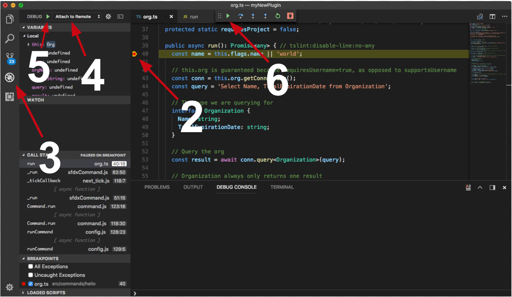

sfdx-easy-sources
=================

This plugin provides tools to simplify Salesforce sources

[](https://npmjs.org/package/sfdx-easy-sources)
[](https://circleci.com/gh/raffo93p/sfdx-easy-sources/tree/master)
[](https://ci.appveyor.com/project/heroku/sfdx-easy-sources/branch/master)
[](https://greenkeeper.io/)
[](https://snyk.io/test/github/raffo93p/sfdx-easy-sources)
[](https://npmjs.org/package/sfdx-easy-sources)
[](https://github.com/raffo93p/sfdx-easy-sources/blob/master/package.json)

<!-- toc -->
* [Debugging your plugin](#debugging-your-plugin)
<!-- tocstop -->
<!-- install -->
<!-- usage -->
```sh-session
$ npm install -g sfdx-easy-sources
$ sfdx COMMAND
running command...
$ sfdx (--version)
sfdx-easy-sources/0.0.1 darwin-arm64 node-v18.11.0
$ sfdx --help [COMMAND]
USAGE
  $ sfdx COMMAND
...
```
<!-- usagestop -->
<!-- commands -->

<!-- commandsstop -->
<!-- debugging-your-plugin -->
# Debugging your plugin
We recommend using the Visual Studio Code (VS Code) IDE for your plugin development. Included in the `.vscode` directory of this plugin is a `launch.json` config file, which allows you to attach a debugger to the node process when running your commands.

To debug the `hello:org` command: 
1. Start the inspector
  
If you linked your plugin to the sfdx cli, call your command with the `dev-suspend` switch: 
```sh-session
$ sfdx hello:org -u myOrg@example.com --dev-suspend
```
  
Alternatively, to call your command using the `bin/run` script, set the `NODE_OPTIONS` environment variable to `--inspect-brk` when starting the debugger:
```sh-session
$ NODE_OPTIONS=--inspect-brk bin/run hello:org -u myOrg@example.com
```

2. Set some breakpoints in your command code
3. Click on the Debug icon in the Activity Bar on the side of VS Code to open up the Debug view.
4. In the upper left hand corner of VS Code, verify that the "Attach to Remote" launch configuration has been chosen.
5. Hit the green play button to the left of the "Attach to Remote" launch configuration window. The debugger should now be suspended on the first line of the program. 
6. Hit the green play button at the top middle of VS Code (this play button will be to the right of the play button that you clicked in step #5).
<br><br>
Congrats, you are debugging!
